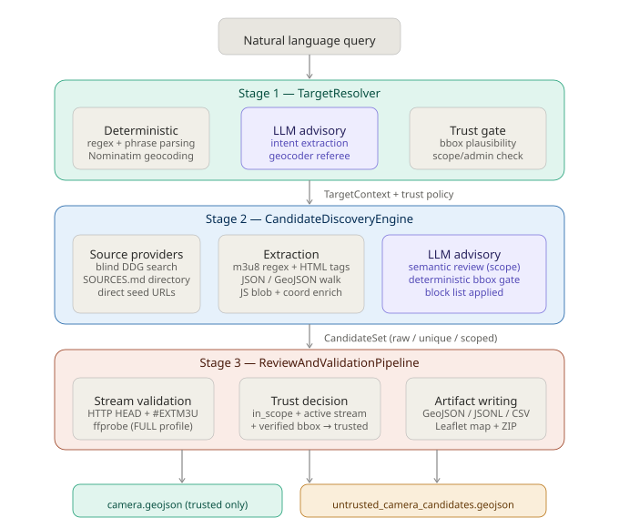

# Camera Discovery

`camera-discovery` is a Python CLI and notebook-supported application for discovering public camera media for a user-specified geography, such as public traffic, weather, webcam, HLS, or refreshing image snapshot cameras.

The repository has two workflows:

| Command | Purpose |
|---|---|
| `camera-discovery run` | Full target-aware pipeline: resolve target(s), discover candidates, enrich/scope coordinates, optionally validate media, write trusted/review artifacts. |
| `camera-discovery harvest-urls` | Extraction-only raw media harvesting: collect URL records and structured camera/media inventory without target resolution, validation, trust, GeoJSON, maps, or review ZIPs. |

The trust boundary is deliberate: LLMs interpret and rank evidence, while deterministic code verifies geometry, validates media, authorizes trusted output, and writes artifacts. A shared neutral evidence layer under `src/camera_discovery/evidence/` normalizes source-provided media evidence for harvest and handoff conversion without assigning scope, validation, or trust.

## Pipeline diagram



## Current architecture

```text
src/camera_discovery/
  cli.py                    # Thin Typer command declarations
  cli_commands/             # Progress and console-output helpers
  runners/                  # Workflow entry points used by CLI/notebooks
  services/                 # Public service classes/facades
  discovery/                # Normal discovery stage helpers
  extraction/               # Shared extraction helpers
  harvest/                  # Harvest-only filters/records/outputs
  enrichment/               # Coordinate/location enrichment helpers
  sources/                  # SOURCES.md registry and block policy
  llm/                      # Provider factory and adapters
  utils/                    # IO and GeoJSON/map helpers
```

The public service import paths are preserved for compatibility:

```python
from camera_discovery.services.discovery_engine import CandidateDiscoveryEngine
from camera_discovery.services.harvest_engine import CameraUrlHarvestEngine
from camera_discovery.services.review_validation_pipeline import ReviewAndValidationPipeline
from camera_discovery.services.target_resolver import TargetResolver
```

## Installation

```bash
python -m pip install -e .
```

Optional extras:

```bash
python -m pip install -e ".[dev]"          # tests/lint/type-check support
python -m pip install -e ".[playwright]"   # Playwright browser backend package
python -m pip install -e ".[cloakbrowser]" # CloakBrowser backend package
python -m pip install -e ".[bedrock]"      # AWS Bedrock provider support
python -m pip install -e ".[notebook]"     # notebook analysis helpers
```

Playwright browser executables are not installed by the package. When real Playwright capture is needed, run:

```bash
python -m playwright install chromium
```

## Normal discovery pipeline

Basic run:

```bash
camera-discovery run "California traffic cameras" --output-dir runs/latest
```

Useful options:

```bash
camera-discovery run "California traffic cameras" \
  --profile fast \
  --discovery-mode both \
  --sources-file SOURCES.md \
  --browser-backend playwright \
  --progress-style plain
```

`run` options include:

```text
--output-dir / -o
--profile fast|balanced|full
--seed-url
--sources-file
--discovery-mode blind|directory|both|direct
--block-pattern
--harvest-input
--harvest-input-mode handoff-only|seed
--harvest-first
--harvest-media
--harvest-max-source-rows
--browser-backend playwright|cloakbrowser
--http-timeout SECONDS
--progress / --no-progress
--progress-style auto|rich|plain|events
```

Profiles:

| Profile | Behavior |
|---|---|
| `fast` | Resolves targets and writes review artifacts, but validation is disabled and trusted output is blocked. |
| `balanced` | Enables deterministic validation of HLS playlists and image snapshots. Validation runs in a bounded worker pool and reuses HTTP clients. |
| `full` | Balanced validation plus bounded HLS variant/media playlist and segment checks. Successful HTTP segment checks produce `active_live_verified`; reachable playlists without full/inconclusive segment checks remain `active_live_unknown`. |

Trusted output requires verified target geometry, in-scope coordinates, successful validation, and target `trust_policy=trusted_allowed`. Review artifacts may contain untrusted, unknown, or out-of-scope candidates for audit.

Validation behavior:

- `camera-discovery run --http-timeout SECONDS` overrides `CAMERA_DISCOVERY_HTTP_TIMEOUT` for run-time network calls, including stream validation.
- Validation is parallelized with a bounded worker pool (`CAMERA_DISCOVERY_VALIDATION_WORKERS`, default 24, clamped to 1–64).
- Validation reuses HTTP clients per worker instead of creating a new client per candidate.
- Plain and event progress report validation candidate counts, for example `validating streams 500/2287`.
- There is no validation candidate cap; every selected validation candidate is attempted unless existing profile/scope/trust logic excludes it.


### GitHub passive source provider

GitHub can be selected as a passive source provider with `CAMERA_DISCOVERY_SEARCH_ENGINES` or `CAMERA_DISCOVERY_HARVEST_SEARCH_ENGINES` (for example, `CAMERA_DISCOVERY_HARVEST_SEARCH_ENGINES=ddg,bing,searxng,github`). It uses public GitHub code search when `CAMERA_DISCOVERY_GITHUB_TOKEN`, `GITHUB_TOKEN`, or `GH_TOKEN` is configured, normalizes GitHub blob URLs to raw files, and records GitHub rows in the same source-row/search diagnostics artifacts as other blind providers. GitHub query templates live in `src/camera_discovery/search_queries/github.py`, not `SOURCES.md`; see `docs/github_source_provider.md`.

## Harvest mode

HLS-only harvest:

```bash
camera-discovery harvest-urls "California traffic cameras" \
  --output-dir runs/harvest-california-hls \
  --discovery-mode both \
  --max-search-queries 12 \
  --max-search-results-per-query 25 \
  --max-source-rows 1000 \
  --max-pages-per-source 10 \
  --max-urls 0 \
  --media .m3u8 \
  --disable-browser-capture \
  --progress-style plain
```

Harvest mode bypasses target resolution, geocoding, validation, trust, scope gates, LLM review, GeoJSON/maps, `cameras.md`, and review ZIPs. It writes raw extraction artifacts such as `camera_urls.jsonl`, `camera_records.jsonl`, `camera_media_assets.jsonl`, `harvest_camera_inventory.jsonl`, `harvest_summary.json`, and `harvest_handoff.json`.

Supported harvest media filters include:

```text
all
hls / .m3u8
rtsp / rtsps / rtsp:// / rtsps://
image / image_snapshot / .jpg / .jpeg / .png / .webp
mjpeg / .mjpg / .mjpeg
video / video_file / .mp4 / .webm / .mov / .m4v
stream
unknown / unknown_media
```

`--write-intermediate-records` writes large debug JSONL files for raw, unique, media-filtered, and image-filtered records. Use it only when debugging extraction or dedupe behavior.

## Harvest handoff into normal pipeline

A harvest handoff can seed the normal pipeline:

```bash
CAMERA_DISCOVERY_ENABLE_BROWSER_CAPTURE=false \
  camera-discovery run "California traffic cameras" \
    --output-dir runs/run-from-harvest-hls \
    --harvest-input runs/harvest-california-hls/harvest_handoff.json \
    --harvest-input-mode handoff-only \
    --progress-style plain
```

`harvest_handoff.json` uses `schema_version: harvest-handoff/v2` and includes `evidence_schema_version: extracted-evidence/v1`. Media-filtered harvests default to the filtered media artifact (`camera_urls.jsonl`), so an HLS-only harvest remains HLS-only when passed to `run --harvest-input`. Referenced records include `source_policy_checked: true` where applicable; `blocked_reason`, when present in diagnostics, is never used to promote output.

`run --harvest-input` supports two explicit modes:

- `handoff-only` (default): uses only the selected harvest handoff records. Native blind/directory discovery, promoted asset-host expansion, and browser crawl expansion are disabled, so candidate counts are bounded by the selected handoff records/assets and resolved target count.
- `seed`: loads the harvest handoff records as starting candidates, then runs the normal discovery pipeline and merges native candidates with handoff candidates. This can be much larger and slower, and should be selected only when that expansion is intentional.

All loaded harvest records remain source-provided, unvalidated, and untrusted until the normal pipeline applies target resolution, deterministic scope gating, validation, and trust rules.


## Harvest-first combined convenience mode

`run` can optionally execute harvest first and then feed the generated handoff into the normal target-aware pipeline:

```bash
camera-discovery run "California traffic cameras" \
  --harvest-first \
  --harvest-media .m3u8 \
  --harvest-max-source-rows 1000 \
  --harvest-input-mode handoff-only
```

This is a convenience orchestration only. Internally it builds a real `HarvestConfig`, runs `CameraUrlHarvestEngine.harvest()`, reads the generated `harvest_handoff.json`, and then continues through the existing `run --harvest-input` path. Harvested records remain source-provided, unvalidated evidence; trusted outputs can only be produced by the normal run pipeline after target resolution, deterministic scope gates, validation, and trust rules.

Combined mode keeps artifact families separate:

```text
<output-dir>/
  harvest/   # camera_urls.*, camera_records.jsonl, media assets, endpoints, inventory, harvest_handoff.json
  run/       # normal discovery summaries, GeoJSON/maps when eligible, validation/dashboard artifacts, review package
```

Harvest-first uses harvest-specific budget flags such as `--harvest-media` and `--harvest-max-source-rows` so harvest-scale collection does not silently rewrite normal run budgets. The handoff manifest remains the formal bridge and includes `evidence_schema_version: extracted-evidence/v1`; referenced harvest records include `source_policy_checked: true` when they have passed source-policy filtering, while any `blocked_reason` remains diagnostic-only and is never an output-promotion signal.

## Browser capture

Browser capture is optional and budgeted. Playwright is the default backend; CloakBrowser is optional.

```bash
camera-discovery run "California traffic cameras" --browser-backend cloakbrowser
camera-discovery harvest-urls "California traffic cameras" --browser-backend cloakbrowser
```

The config can also be set with:

```bash
CAMERA_DISCOVERY_BROWSER_BACKEND=cloakbrowser
```

Browser preflight writes diagnostics and prevents repeated page-level failures when the selected backend is unavailable. Do not interpret a missing browser backend as successful capture.

## LLM providers

Default provider is Ollama Cloud unless overridden. Relevant variables include:

```bash
CAMERA_DISCOVERY_LLM_PROVIDER=ollama-cloud
CAMERA_DISCOVERY_LLM_MODEL=gemma3:27b-cloud
OLLAMA_API_KEY=...
OLLAMA_BASE_URL=https://ollama.com
```

Stage-specific overrides include:

```bash
CAMERA_DISCOVERY_TARGET_INTENT_MODEL=
CAMERA_DISCOVERY_TARGET_INTENT_FALLBACK_MODEL=
CAMERA_DISCOVERY_GEOCODER_REFEREE_MODEL=
CAMERA_DISCOVERY_LOCATION_INFERENCE_MODEL=
CAMERA_DISCOVERY_CANDIDATE_REVIEW_MODEL=
```

Other provider values supported by the shared factory include `ollama`, `openai-compatible`, `openai`, `openai_compatible`, and `bedrock`.

## SOURCES.md

`SOURCES.md` contains user-approved directory seed sources and global blocked-source patterns. Allowed sources are used only in `directory` and `both` modes. Blocked patterns are global and apply across blind search, directory rows, direct seed URLs, fetched pages/endpoints, extracted media URLs, harvest outputs, and final candidates.

The default `SOURCES.md` resolves from the working directory when present and falls back to the editable repository root for console-script/notebook runs.

## Candidate priority

Coordinate-bearing, deterministically in-scope candidates are prioritized for validation budgets, candidate tables, and GeoJSON/review ordering. Coordinates alone do not make a camera trusted. Out-of-scope coordinate-bearing candidates are not promoted above in-scope candidates.

Priority diagnostics are written to logs such as:

```text
logs/candidate_priority_summary.json
logs/validation_priority_summary.json
```


## Google Colab notebooks

End-to-end Colab notebooks live under `notebooks/`:

| Notebook | Purpose |
|---|---|
| `camera_discovery_harvest_hls_only_test.ipynb` | HLS-only harvest workflow using routine `.m3u8` extraction settings. |
| `camera_discovery_harvest_first_hls_balanced_validation_test.ipynb` | One-command `run --harvest-first --harvest-media .m3u8` workflow through balanced validation, with separate `harvest/` and `run/` artifacts. |
| `camera_discovery_harvest_hls_handoff_full_validation_test.ipynb` | HLS harvest followed by visible `run --profile full --http-timeout 10 --harvest-input --harvest-input-mode handoff-only ...` for full media validation. |
| `camera_discovery_harvest_all_media_handoff_full_validation_test.ipynb` | All-media harvest followed by visible bounded handoff validation/review with `--http-timeout 10`. |
| `camera_discovery_pipeline_only_profiles_test.ipynb` | Pipeline-only comparison for `fast`, `balanced`, and `full` profiles. |

The notebooks include Ollama Cloud / `OLLAMA_API_KEY` Colab userdata setup, CLI/import smoke tests, browser-backend visibility, completion-aware run guards, diagnostic inspection cells, and optional artifact packaging. Notebook-only helper code remains inside the notebooks and is not part of `src/`.

## Development checks

```bash
python -m compileall -q src tests
PYTHONPATH=src python -m pytest -q
python -m ruff check src tests
python -m mypy src/camera_discovery/core src/camera_discovery/llm
```

GitHub Actions in `.github/workflows/tests.yml` runs compile, Ruff, pytest, and a MyPy smoke check on pushes/PRs for Python 3.11 and 3.12.


## Media playlists, RTSP, dashboard, and guarded dorking

Normal `camera-discovery run` outputs now include deterministic playlist convenience views under `playlists/` and a top-level `media_validation_dashboard.json`. Playlist files are derived from the current candidate/trust/validation state; they do not promote a camera to trusted inventory and they still respect `SOURCES.md`, block patterns, and private/local URL rejection. Typical playlist files include `trusted_media.m3u`, `trusted_media.txt`, `untrusted_review_media.m3u`, `hls_candidates.m3u`, `rtsp_candidates.m3u`, `live_or_reachable_media.m3u`, `dead_or_restricted_media.txt`, and `image_snapshots.txt`.

RTSP support is limited to explicit `rtsp://` or `rtsps://` URLs supplied by the user or extracted verbatim from allowed public source pages/endpoints. The application does not synthesize RTSP URLs, probe common paths, enumerate ports, or test credentials. RTSP candidates are classified as `media_type=rtsp`; validation uses bounded `ffprobe` only when the selected profile/config enables ffprobe validation (currently the `full` profile) and `ffprobe` is available on the host. If ffprobe is disabled by profile/config, RTSP returns `rtsp_validation_disabled`; if it is enabled but missing, RTSP returns `rtsp_validation_unavailable`. Attempted RTSP validation may return `active_rtsp_verified`, `auth_required_rtsp`, `offline_rtsp`, or `dead_rtsp`. Browser maps show RTSP as an external-player URL rather than attempting hls.js playback.

Harvest mode can filter RTSP with `--media rtsp` or include it with `--media stream`; it remains extraction-only and writes harvest playlist summaries when playable media records are present.

Dork query patterns are guarded public-source discovery only and are enabled by default. Disable them with `CAMERA_DISCOVERY_ENABLE_GOOGLE_DORKING=false` or cap them with `CAMERA_DISCOVERY_MAX_DORK_QUERIES`. Generated operator queries are bounded, target-aware, camera-intent-aware, prefer `site:` restrictions to allowed `SOURCES.md` domains, and are submitted as `query_type=dork` to each configured supported search backend (DDG, Bing, SearXNG when configured; GitHub-targeted web dorks when the GitHub provider is selected; Google only if a real supported backend exists). Missing `searxng_base_url` skips only SearXNG attempts, and missing GitHub tokens skip only GitHub attempts. The code forbids dorks for device admin/login pages, default credentials, vendor fingerprints, common RTSP paths, private networks, or blocked internet-asset indexes.


## Passive camera intelligence

The discovery and validation pipeline now includes a passive intelligence layer. It deterministically scores source rows and candidates, applies safe camera/media URL signature matching to already-discovered evidence, captures allowlisted HTTP metadata from requests the pipeline already makes, adds richer protocol labels, and writes explanation artifacts showing why sources and candidates mattered. Passive evidence affects prioritization and review only; it never bypasses `SOURCES.md`, target scope, media validation, or trusted-output rules. See `docs/passive_intelligence.md`.

### International official-source discovery

camera-discovery now includes country/language-aware official-source query expansion for public camera source discovery. Mexico and Ukraine are covered by regression tests, and unknown countries use ISO alpha-2 ccTLD hints where available. Unsafe direct device-interface dorks are intentionally excluded. See `docs/international_official_source_discovery.md`.


### Candidate table and diagnostics updates

`camera_candidates_table.csv` contains all unique candidates considered by the run, not only trusted or non-rejected rows. Use `candidate_disposition`, `validation_status`, `trust_level`, and `scope_status` to distinguish trusted inventory, untrusted review, dead, restricted, out-of-scope, unknown-location, and not-validated candidates. `run/logs/run_summary.json` is summary-only; detailed candidate data lives in the candidate CSV, `logs/validation_results.jsonl`, `logs/candidate_evidence_summary.jsonl`, and per-target candidate JSONL files.

Harvest mode writes `harvest/logs/search_service_summary.json` with real backend rows for `ddg`, `bing`, `searxng`, `github`, and `google` plus a global summary. Dorks are query patterns (`query_type=dork`), not a backend; the summary includes normal/dork query counts per engine, accurate engine-specific skip reasons, and duplicate-query suppression counts.

For efficient harvest-first HLS full validation, run `camera-discovery run --harvest-first --harvest-media .m3u8 --harvest-input-mode handoff-only --profile full --http-timeout 10` and keep browser capture disabled unless dynamic extraction is required.


### Media validation dispatcher

The run pipeline dispatches validation by normalized media/protocol evidence, not camera category. HLS, image snapshots, RTSP, MJPEG, direct video files, and unknown media each have explicit validator paths. Unknown media performs bounded classification and delegates once only when URL/header/content evidence proves a supported type. Direct MP4/MOV/WEBM/M4V files are reported as reachable video files, not automatically as live streams; `active_live_verified` is reserved for validators that prove live/segment/stream evidence.
